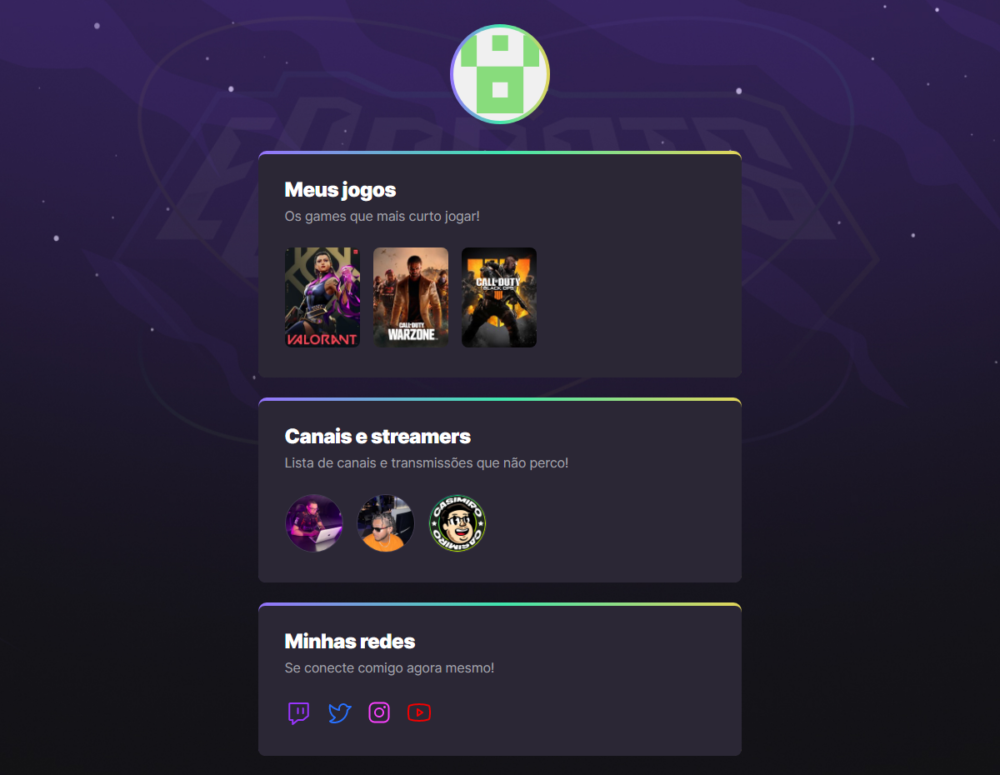

# eSports-Explorer

<a href="https://github.com/bw3sley/eSports-explorer/blob/main/LICENSE.md">
    
</a>

</br>



[Click here to see the design](https://www.figma.com/community/file/1150897317533332617) you need to have an account on [Figma](https://www.figma.com/).

## 💻 About this project

This project was developed by me during one of many Rocketseat's Next Level Week (NLW), my tutor was [Mayk Brito](https://www.github.com/maykbrito). This project proposal was to develop a website that showcases my game hub.

I'll be happy if you could send me any feedback about the project, code, structure or anything that you can report that could make me better as a developer!

And you can use this project as you wish!

## :octocat: Cloning repo

```bash
    $ git clone https://github.com/bw3sley/eSports-explorer.git
    
    $ cd eSports-explorer
```

## 🚀 Built with

This project was built with:    

- HTML
- CSS

## 📩 Reach me out

You can reach me at:

Reach me at: bw3sley@gmail.com

Connect with me at [LinkedIn](https://www.linkedin.com/in/bw3sley)

## 📝 License

This project is licensed under the MIT License - see the [LICENSE.md](./LICENSE.md) file for details.